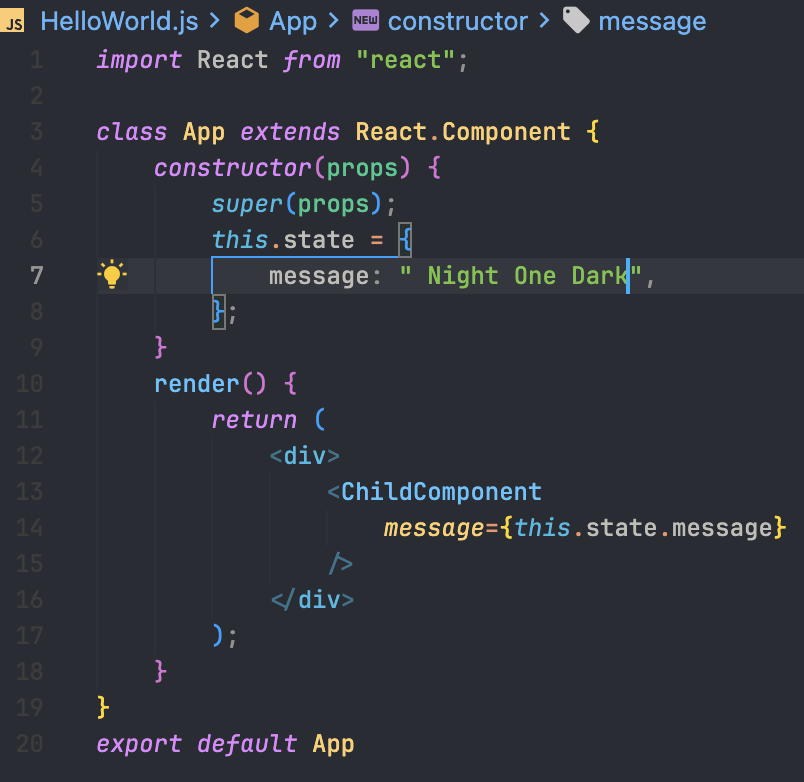

# Night One Dark - Visual Studio Code Theme

Night One Dark is a stylish Visual Studio Code theme inspired by the popular Atom One Dark color scheme. It brings a modern and elegant look to your code editor, making your coding experience more enjoyable.

## Features

- Dark background with carefully selected color palette for optimal readability.
- Designed to reduce eye strain during long coding sessions.
- Syntax highlighting for various programming languages.
- Consistent and harmonious colors across different file types.

## Installation

1. Open **Extensions** sidebar panel in Visual Studio Code. `View → Extensions`
2. Search for `Night One Dark`.
3. Click **Install** to install it.
4. Click **Reload** to reload the your editor.
5. Go to `Code > Preferences > Color Theme > Night One Dark`.

## Screenshots

## Contributing

If you find any issues or have suggestions to improve the theme, feel free to [contribute on GitHub](https://github.com/ardi-nugraha/Night-One-Dark-theme)!

## License

This project is licensed under the MIT License - see the [LICENSE](LICENSE) file for details.

---

Enjoy coding with Night One Dark theme! If you like it, consider giving it a star on [GitHub](https://github.com/ardi-nugraha/Night-One-Dark-theme).

**Happy Coding!** 🌙✨
